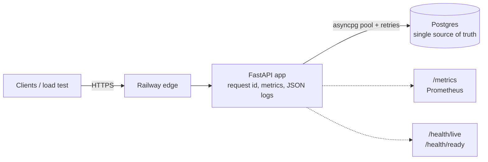
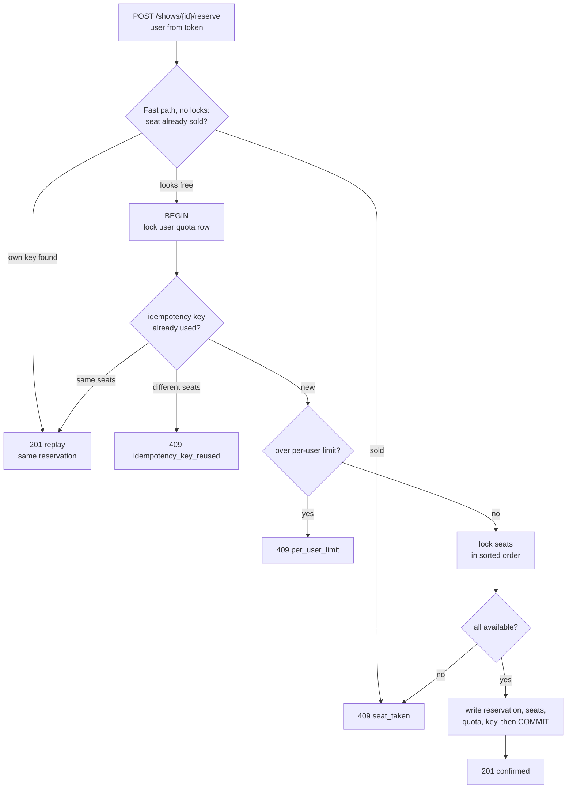
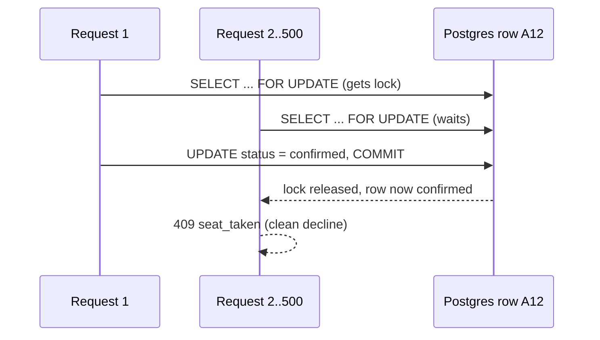

# Seat Reservation Service

Sells assigned seats under heavy contention: never double-sells a seat,
never exceeds a user's limit, never double-books a retried request.

**Live:** https://seat-reservation-production-ace1.up.railway.app
(admin key for creating shows is in the submission email)


## How it works

### Architecture


### The reservation decision
One request, one transaction. Every decline rolls back completely.


### Why a hot seat is never sold twice


## Run it
```bash
# Same as production (app + Postgres, app waits for a healthy DB)
docker compose up -d --build --wait
curl localhost:8000/health/ready

# Local development
uv sync
docker compose up -d --wait db
uv run uvicorn app.main:app --env-file .env --reload
```
Copy `.env.example` to `.env` for local development.

## API
| Method | Path | Auth | Notes |
|---|---|---|---|
| POST | `/auth/token` | none (`X-Admin-Key` for admin) | test helper, issues JWTs |
| POST | `/shows` | admin | `{name, seats[], price_paise, per_user_limit?}` |
| GET | `/shows/{id}` | none | per-seat status, counts, `invariant_ok` |
| POST | `/shows/{id}/reserve` | user | `{seats[], idempotency_key}` (or `Idempotency-Key` header) |
| POST | `/reservations/{id}/cancel` | owner | releases only seats still on this reservation |
| GET | `/health/live` | none | process is up |
| GET | `/health/ready` | none | DB reachable, else 503 (fails closed) |
| GET | `/metrics` | none | Prometheus |

Outcomes: `201` confirmed · `409` `seat_taken` / `per_user_limit` /
`idempotency_key_reused` · `400` / `404` / `422` for bad input ·
`429` + `Retry-After` only as last-resort backpressure. Money is integer paise.

## Burst test
```bash
read -s ADMIN_KEY && export ADMIN_KEY
./burst.sh https://seat-reservation-production-ace1.up.railway.app --users 5000
```
Creates a fresh show, then fires a stampede (hot-seat storm, random seats,
same-key duplicates sent simultaneously, one user over the limit,
spoofed `user_id`), polls the invariant during the burst, and prints
PASS/FAIL for each correctness rule.

## Observability
- **Metrics** (`/metrics`): `reservations_confirmed_total`,
  `reservations_declined_total{reason}`, `seats_available{show_id}`
  (read from the DB at scrape time, so it always reconciles with the API),
  `http_requests_total`, `http_request_duration_seconds`.
- **Logs:** one JSON line per request with `request_id` (also returned as
  `X-Request-ID`). Railway logs are project-private, so a screen recording
  of the live logs under load is included.

## Design
See [WRITEUP.md](WRITEUP.md).